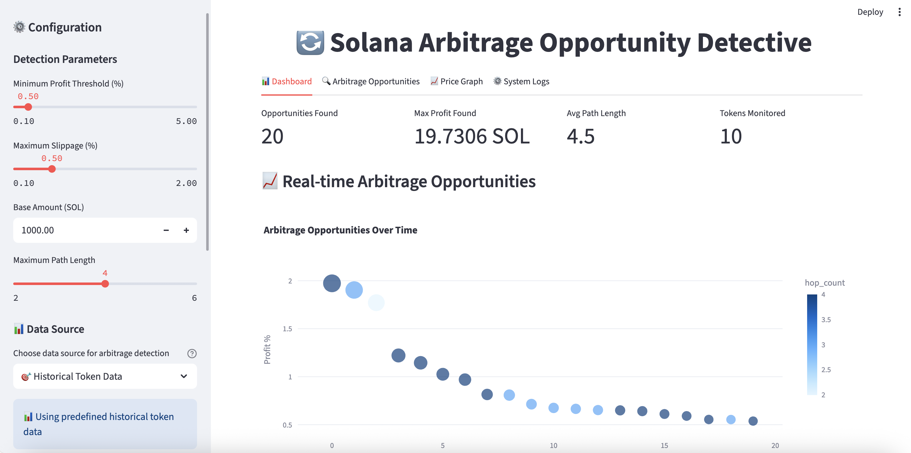
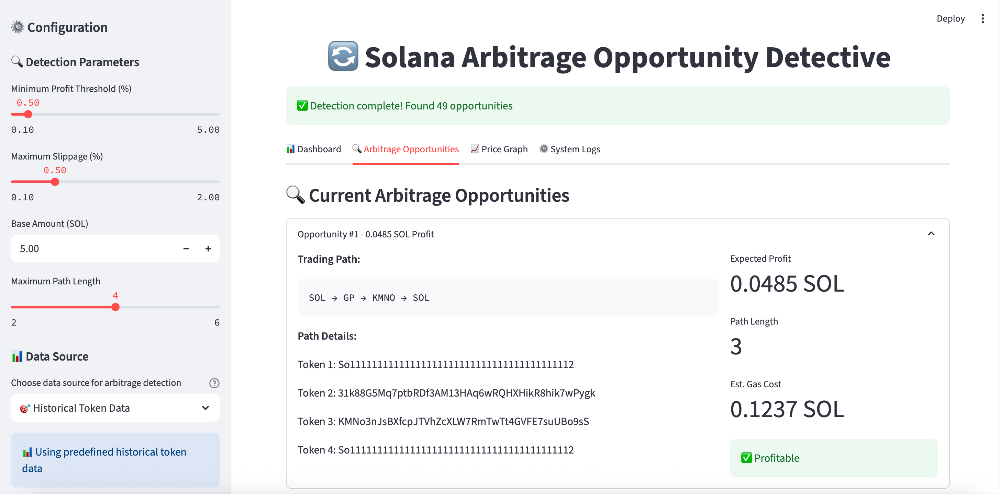

# Crypto-Arbitrage-Detector

A powerful Solana-based arbitrage detection and execution engine, designed to analyze token swap paths across top decentralized exchanges and execute profitable routes via Jupiter aggregator.

# Table of Contents

1. [Features](#features)
2. [Preview](#preview)
3. [Prerequisite](#prerequisite)
4. [Installation](#installation)
5. [Usage](#usage)
6. [Project Structure](#project-structure)
7. [Console Workflow](#console-workflow)

## Features

- Real-time liquidity ranking via Jupiter API
- Detects profitable arbitrage opportunities using multiple algorithms:
  - Bellman-Ford
  - Triangle arbitrage
  - Two-hop path
  - Exhaustive DFS
- risk evaluation and confidence scoring
- Graph analytics and visualization
- Automatically constructs and executes multi-hop swap transactions
- Trade confirmation and private key-based transaction signing

---

## Preview




---

## Prerequisite

- Python 3.8+
- Streamlit 1.28.0
- Other dependencies (check [requirements.txt](requirements.txt))
  
---

## Installation

1. **Clone this repository**  
    ```bash
    git clone https://github.com/yourname/crypto-arbitrage-detector.git
    cd crypto-arbitrage-detector
    ```

2. **Create a virtual environment (recommended)**
    ```bash
    python3 -m venv venv
    source venv/bin/activate
    ```

3. **Install dependencies**
    ```bash
    pip install -r requirements.txt
    ```

---

## Usage

**user interface:**
    ```bash
    streamlit run app.py
    ```

**console with transaction functionality:**
    ```bash
    python main.py
    ```

---

## Project Structure

```text
Crypto-Arbitrage-Detector/
├── app.py                               ← User Interface Entry point: CLI logic  
├── main.py                              ← Console Entry point: CLI logic  
├── requirements.txt                     ← Python dependencies  
├── README.md                            ← Project overview and usage guide  

├── crypto_arbitrage_detector/           ← Core project module  
│   ├── scripts/                         ← Scripts for fetching and loading token data  
│   │   ├── volume_fetcher.py            ← Fetch and rank tokens from Jupiter  
│   │   ├── download_tokens.py           ← Download and save the whole token list  
│   │   ├── token_loader.py              ← Load tokens from pkl file  
│   │   └── jupiter_client.py            ← Enrich tokens with info from Jupiter API  
│  
│   ├── utils/                           ← Utility functions and helpers  
│   │   ├── data_structure.py            ← Data structures used across the project  
│   │   ├── get_quote_pair.py            ← Get edge pairs from Jupiter API  
│   │   ├── simulate_gas_fee.py          ← Simulate gas fee from Jupiter and Solana RPC  
│   │   ├── enrich_gas_fee.py            ← Enrich token pairs with gas fee info  
│   │   ├── transaction.py               ← Build, sign, send transactions + error handling  
│   │   ├── ATA_handle.py                ← Create token ATA for user  
│   │   ├── graph_structure.py           ← Create edge pairs graph  
│   │   ├── graph_utils.py               ← Visualize edge pairs graph  
│   │   └── frontend_utils.py            ← Helper methods for user interface (`app.py`)  
│  
│   ├── algorithms/                      ← Arbitrage detection logic  
│   │   ├── arbitrage_detector_integrated.py    ← Algorithms Integrations  
│   │   ├── bellman_ford_algorithms.py          ← Bellman-Ford algorithms for arbitrage  
│   │   ├── exhaustive_dfs_algorithms.py        ← Exhaustive DFS algorithms for arbitrage  
│   │   ├── triangle_arbitrage_algorithms.py    ← Triangle arbitrage detection  
│   │   ├── two_hop_arbitrage_algorithms.py     ← Two-hop arbitrage detection  
│   │   └── risk_evaluator.py                   ← Evaluate risk of arbitrage paths  
│  
│   └── config/                         ← Configuration files  
│       ├── request_config.py            ← API call configurations  
│       └── strategy_config.py           ← Arbitrage algorithm strategies  
│  
├── data/                                ← Cached token and historical data  
│   ├── jupiter_tokens.json              ← All Jupiter token list  
│   ├── enriched_tokens.pkl              ← Filtered top tokens list  
│   └── historical_data.py               ← Cached historical token pairs  
│  
├── tests/                               ← Unit tests and mock data  
│   ├── mock_quote_pair.py               ← Predefined token pairs for testing  
│   ├── mock_token_info.py               ← Predefined token info for testing  
│   ├── test_algorithms.py               ← Tests for arbitrage algorithms  
│   ├── test_get_pair.py                 ← Tests for quote pair retrieval  
│   ├── test_jupiter_client.py           ← Tests for Jupiter client functions  
│   ├── test_gas_fee.py                  ← Tests for gas fee enrichment  
│   └── test_transaction.py              ← Tests for transaction execution  
│  
└── .gitignore                           ← Files and folders to exclude from Git
```


---
## User Interface Workflow

1. streamlit run app.py
   

## Console Workflow

1. Run python main.py

2. A four options menu will display:
    * Update Token List
    Fetch and store the latest token list from Jupiter's token registry.

    * Analyze Arbitrage from Historical Data
    Run arbitrage analysis based on pre-collected historical test data.
    You’ll be prompted to:
        Set a minimum profit threshold (default: 0.005).
        Choose whether to enable risk evaluation (to filter risky opportunities).
        Set the base token amount to simulate the arbitrage trade.
    The system builds a token swap graph from this test dataset and detects profitable arbitrage paths.
    Optionally, you can execute a selected trade by providing your private key, public key and trading amount.

    * Live Arbitrage Analysis and Trading
    Analyze real-time arbitrage opportunities based on live Jupiter API token data.
    You’ll be prompted to:
        Set a minimum profit threshold (default: 0.005).
        Choose whether to enable risk evaluation (to filter risky opportunities).
        Set the base token amount to simulate the arbitrage trade.
        Free API access (may be unstable or rate-limited),
        Or Paid API access (by providing your Jupiter API key).
    Arbitrage paths will be computed on-the-fly using Jupiter quotes.
    Optionally, you can execute a selected trade by providing your private key, public key and trading amount.

    * Quit
    Exit the program

3. Notes on Trading:
    * Make sure you have sufficient balance — ideally for all tokens involved in the arbitrage route.

    * For free Jupiter API you are using https://quote-api.jup.ag/v6/swap and https://quote-api.jup.ag/v6/quote, it can not gurantee go through and will have strict rate limit per minute. Frequent requests to the Jupiter API may be interpreted as scraping and could lead to your IP being rate-limited or blocked.You can choose to upgrade for higher limits: https://portal.jup.ag/pricing.

    * For free Solana RPC You are using mainnet RPC (e.g., https://api.mainnet-beta.solana.com), a private/paid RPC can provide a better transaction speed and succeed rate.

    * The simulated base amount should closely align with the actual transaction amount to ensure arbitrage success.

